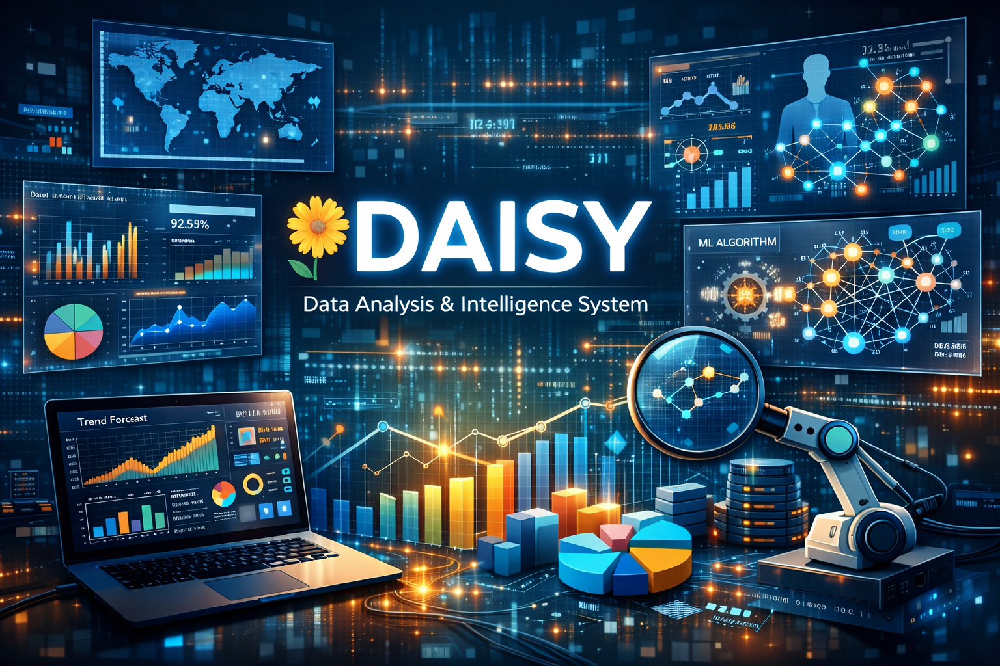

  

# DAISY – Data Analysis & Intelligence Systemsssss

## Overview
DAISY (Data Analysis & Intelligence System) is an end-to-end data science project designed to analyze large real-world datasets and extract meanin

# 🌼 DAISY – Data Analysis & Intelligence System
## 📌 Overview
**DAISY (Data Analysis & Intelligence System)** is an end-to-end data science project designed to analyze large real-world datasets and extract meaningful insights that support strategic decision-making and identify future growth opportunities.

This project focuses on transforming raw data into **actionable intelligence** using statistical analysis, exploratory data analysis, and machine learning techniques.

---

## 🎯 Project Objective
- Analyze large-scale datasets sourced from Kaggle
- Identify hidden patterns, trends, and anomalies
- Generate meaningful insights for decision-making
- Forecast future trends and potential growth area
- Provide data-driven recommendations using analytical logic

---

## 🧠 Key Features
- Data cleaning and preprocessing pipeline
- Exploratory Data Analysis (EDA)
- Trend and growth analysis
- Customer/segment clustering
- Predictive modeling (forecasting & regression)
- Insight and recommendation engine
- Interactive visualizations and dashboards

---

## 🗂 Dataset
- Source: **Kaggle**
- Dataset Type: Large-scale real-world dataset  
  *(Retail / Business / Entertainment / Economics – finalized during research phase)*

---

## 🛠️ Tech Stack
- **Language:** Python  
- **Libraries:** Pandas, NumPy, Matplotlib, Seaborn, Scikit-learn  
- **ML Techniques:** Regression, Clustering, Time-Series (optional)  
- **Visualization:** Plotly / Streamlit  
- **Version Control:** Git & GitHub  

---

## 📈 Expected Insights
- Growth trends across categories, regions, or time
- High-potential and underperforming segments
- Correlation between key business variables
- Forecasted future opportunities and risks

---

## 🚀 Future Scope
- Support multiple datasets and domains
- Add automated insight generation
- Deploy as a web-based analytics platform
- Integrate NLP for textual data analysis
- Enhance recommendation engine with advanced ML models

---

## 📅 Project Timeline
The project follows a structured development timeline, focusing on research, setup, implementation, and analysis.

(See detailed roadmap below)

---

## 👤 Author
**Ansh Gaur**  
Aspiring Data Scientist | Python | Data Analysis | Machine Learning

